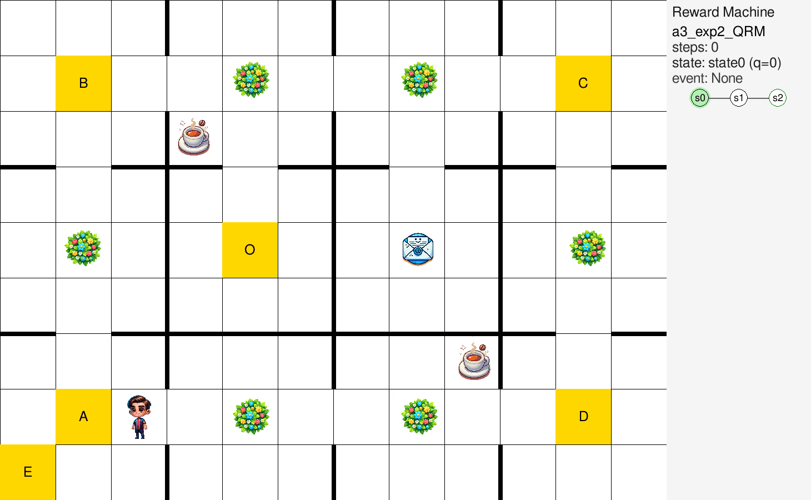
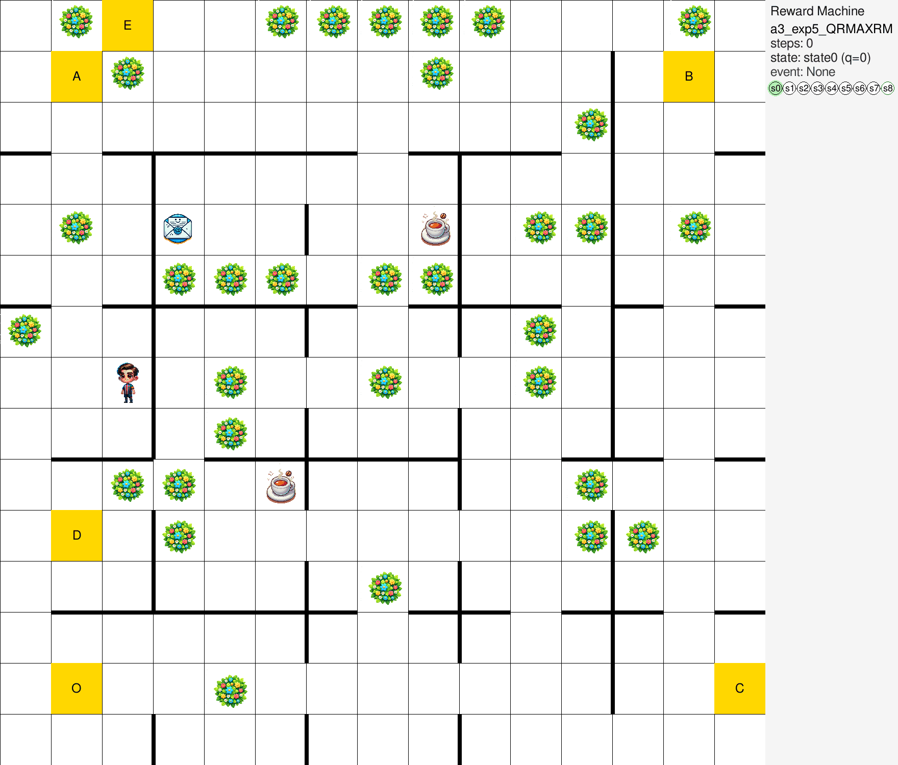

# OfficeWorld + Reward Machines

This folder contains the **MultiAgentOfficeWorld** grid-world environment and the main experiment runner `office_main.py`. Tasks are represented as **Reward Machines (RMs)**: finite-state automata whose transitions are triggered by environment events (here: reaching specific grid positions).

## Key files

- `ma_office.py`: environment dynamics (movement, walls, stochasticity, penalties).
- `office_main.py`: experiment entrypoint (training loop, evaluation, optional VI baseline/plots).
- `config_office.py`: maps, built-in experiments (RM transition maps) and global settings.
- `state_encoder_office.py`: encodes `(x, y, q_rm)` into a single integer state id for tabular algorithms.
- `action_encoder_office_world.py`: registers symbolic actions `up|down|left|right`.
- `detect_event.py`: `PositionEventDetector` (event = current position if in a watched set).
- `event_context.py`: builds the OfficeWorld context used by `rmgen` for allowed/normalized events.

## Rendered episodes (GIFs)

Easy task (map1, `exp2`):

<p align="center">
  
</p>
Harder task (larger map3, `exp5`):

<p align="center">
  
</p>
## Map format & parsers (`parse_office_world`)

OfficeWorld maps are defined as emoji layouts in `config_office.py`. The parser `multiagent_rlrm.utils.utils.parse_office_world(layout)` converts the layout into:

- `coordinates`: object locations
  - `🪴` → `plant`
  - `🥤` → `coffee`
  - `✉️` → `letter` (the RM also accepts the alias `email`)
  - `🟩` → `empty_cell`
- `goals`: dictionary `{label -> (x, y)}` for letters/digits (`A`, `B`, ..., `O`, `1`, ...)
- `walls`: blocked adjacencies between neighboring cells, represented as segments `((x1, y1), (x2, y2))`

### Cells vs separators (`⛔`, `🚪`) and wall extraction

In the raw layout string, `⛔` and `🚪` are used as *separators* (they are not traversable cells). Internally:

1. `parse_office_world` removes `⛔` and `🚪` to obtain a compact grid of actual cells and assigns `(x, y)` coordinates on that compact grid.
2. `find_disconnected_pairs(layout)` scans the original layout to detect where two cells are separated by a `⛔` marker and returns the corresponding blocked edges.
3. `office_main.py` duplicates these edges in both directions so wall checks can be done with directed pairs.

### Coordinate system and actions

- Coordinates are `(x, y)` on the compact grid returned by the parser; `(0, 0)` is the first (top-left) cell row/column of that grid.
- In `ma_office.py`, action application follows:
  - `up`: `y += 1`
  - `down`: `y -= 1`
  - `left/right`: `x -= 1` / `x += 1`

## Built-in experiments (built-in RMs)

`config_office.py:get_experiment_for_map(...)` defines each experiment as a transition map `{(rm_state, position): (next_rm_state, reward)}` plus the set of relevant positions.

Common experiment ids (see `AVAILABLE_EXPERIMENTS` in `office_main.py`):

- `exp0_simply`: Letter
- `exp0`: Letter → Coffee → Office
- `exp1`: Coffee → Office
- `exp2`: Letter/Email → Office
- `exp3`: Coffee + Letter/Email → Office
- `exp4`: A → B → C → D
- `exp5`: A → B → C → D, then Coffee + Letter/Email → Office
- `exp6`: A → B → C → D → E, then Coffee + Letter/Email → Office
- `exp7`: Coffee → Office variant (different reward magnitudes)

## Authoring an RM (Python vs natural language)

You can define an RM in two “human-friendly” ways:

- **Python**: write a transition dictionary in code (either directly in your script or via the built-in experiment definitions in `config_office.py`).
- **Natural language**: describe the task and use `rmgen` to generate a JSON/YAML RM spec, then load it with `--rm-spec`.

Both workflows ultimately attach a `RewardMachine` to the agent.

### Writing an RM in Python (hard-coded)

Minimal pattern (similar to what built-in experiments do):

```python
from multiagent_rlrm.multi_agent.reward_machine import RewardMachine
from multiagent_rlrm.environments.office_world.detect_event import PositionEventDetector

transitions = {
    ("state0", goals["A"]): ("state1", 0),
    ("state1", goals["B"]): ("state2", 1),
}
rm = RewardMachine(transitions, PositionEventDetector({goals["A"], goals["B"]}))
agent.set_reward_machine(rm)
```

## Loading an RM spec from file (`--rm-spec`)

`office_main.py` can ignore the built-in experiment RM and load a JSON/YAML RM spec:

- `--rm-spec PATH`

When a spec is provided:

- `env_id` must be `officeworld`
- events are normalized/validated against the selected map context (`event_context.py`)
- optional completion: `--complete-missing-transitions --default-reward 0.0`
- safety flags: `--terminal-self-loop/--no-terminal-self-loop`, `--terminal-reward-must-be-zero/--no-terminal-reward-must-be-zero`, `--max-positive-reward-transitions`

Event tokens typically used in specs:

- goal symbols: `A` or `at(A)` (canonical form is `at(<LABEL>)`)
- `office` / `at(office)` (mapped to `O` if present)
- `coffee`, `letter` / `email` (expanded to all coffee/letter positions in the map)

## Generating an RM from natural language (rmgen)

You can generate a valid RM spec directly from a natural-language description using the `rmgen` CLI. Example (OfficeWorld, map1):

```bash
python -m multiagent_rlrm.cli.rmgen \
  --provider openai_compat --base-url http://localhost:11434/v1 --model llama3.1:8b \
  --context officeworld --map map1 \
  --task "A -> C -> B -> D (in order), reward 1 on D" \
  --output /tmp/rm_office.json
```

Then train with it:

```bash
python multiagent_rlrm/environments/office_world/office_main.py \
  --map map1 --experiment exp4 --algorithm QL \
  --rm-spec /tmp/rm_office.json
```

Note: `rmgen` needs an LLM backend (any OpenAI-compatible endpoint or similar). If you don't have one, write the JSON/YAML spec by hand and pass it via `--rm-spec`.

## Running

From the repository root:

```bash
python multiagent_rlrm/environments/office_world/office_main.py \
  --map map1 --experiment exp4 --algorithm QL
```

Stochastic dynamics:

```bash
python multiagent_rlrm/environments/office_world/office_main.py \
  --stochastic --highprob 0.8 --map map1 --experiment exp1 --algorithm QL
```

## CLI arguments

For the authoritative list, run:

```bash
python multiagent_rlrm/environments/office_world/office_main.py --help
```

Condensed reference (defaults shown are the current code defaults; some values are adjusted at runtime):

### Experiment selection / control

| Flag | Default | Description |
|---|---:|---|
| `--map` | `map1` | Which map to use (`config_office.py`). |
| `--experiment` | `exp1` | Which built-in experiment/task to run. |
| `--algorithm` | (from config) | Algorithm to use (default is the first agent algorithm in `config_office.py` for the selected map). |
| `--seed` | `100` | Seed for environment resets / reproducibility. |
| `--steps` | (config) | Max training steps; if omitted, uses `config["global_settings"]["max_step"]`. |
| `--eval` | `1000` | Evaluation interval in training steps. |
| `--early_stop` | `False` | Enable early-stopping logic (if supported by the experiment loop). |
| `--save` | (none) | Path to save the final trained model/policy. |
| `--load` | (none) | Path to load a pre-trained model/policy. |
| `--play` | (none / `100`) | Execute a loaded policy for N evaluation episodes (if provided without a number, defaults to `100`). |
| `--sweep_id` | (none) | Optional sweep id (W&B sweeps). |

### Environment dynamics

| Flag | Default | Description |
|---|---:|---|
| `--stochastic` | `False` | Enable stochastic action outcomes. |
| `--highprob` | `0.8` | Probability of the intended action outcome (only meaningful with `--stochastic`). |
| `--all-slip` | `False` | If set, slipping can happen in all directions (only with `--stochastic`). |

Note: when `--stochastic` is **not** set, `office_main.py` forces `Kthreshold=1` and `learning_rate=1.0` regardless of CLI values.

### Reward Machine spec (optional)

| Flag | Default | Description |
|---|---:|---|
| `--rm-spec` | (none) | Path to an RM spec file (`.json/.yaml`) overriding the built-in experiment RM. |
| `--complete-missing-transitions` | `False` | Auto-complete missing spec transitions (self-loops). |
| `--default-reward` | `0.0` | Reward used for auto-completed transitions. |
| `--terminal-self-loop` / `--no-terminal-self-loop` | `True` | When completing transitions, include/exclude terminal self-loops. |
| `--terminal-reward-must-be-zero` / `--no-terminal-reward-must-be-zero` | `True` | Enforce/relax the “terminal outgoing reward must be 0” constraint. |
| `--max-positive-reward-transitions` | (none) | Optional safety check on number of positive-reward transitions. |

### Algorithm / VI parameters

| Flag | Default | Description |
|---|---:|---|
| `--gamma` | `0.9` | Discount factor used by learning algorithms and evaluation. |
| `--Kthreshold` | `39` | Known-threshold for RMAX/QRMAX in stochastic envs (forced to `1` if deterministic). |
| `--learning_rate` | `0.1` | Learning rate for Q-learning/QRM in stochastic envs (forced to `1.0` if deterministic). |
| `--VIdelta` | `1e-2` | Value-iteration convergence threshold. |
| `--VIdeltarel` | `True` | Use relative VI delta threshold. |
| `--vi_cache` | `False` | Use cached VI results if available. |

### Rendering / logging

| Flag | Default | Description |
|---|---:|---|
| `--render` | `False` | Enable rendering (pygame). |
| `--generate_heatmap` | `False` | Save heatmaps after training. |
| `--wandb` | `False` | Enable Weights & Biases logging. |

## Outputs

- `multiagent_rlrm/environments/office_world/results/`: CSV logs created by `office_main.py`.
- `heatmaps/`: saved heatmaps (relative to the working directory).
- `vi_cache/`: VI cache (relative to the working directory).
